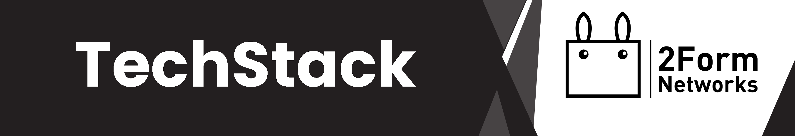

# Kurylo's Software List
(Last Updated: September 2023)

## Development
    Code-Editor: Visual Studio Code
    Code-Editor: JetBrain's Fleet

    IDE: JetBrain's Rider
    IDE: JetBrain's PyCharm
    IDE: JetBrain's PhpStorm

    IDE: Visual Studio Pro
    IDE: Android Studio

    Terminal: Alacritty
    Version-Control: GitHub
    Version-Control: DevOps Azure
### Extensions: 
    Visual Studio: 
    - VsVim
    - ReSharper
    - Rainbow Brackets

    VSCode:
    - Auto Rename Tag
    - Auto-Using
    
    - Better Comments
    - Discord Rich Presence
    - GitHub Copilot
    - GitHistory
    - GitLens
    
    - vscode-pets
    - indent-Rainbow
    - npm Intellisense

    - Peacock
    - Prettier
    - Vim

## Audio
    DAW: Studio One 5
    DAW: Studio One 4 Artist

    Voice Synth: Vocaloid 4
    Voice Synth: Vocaloid 2

    VSTi: Piapro Studio

    Voicebank: Hatsune Miku V4X
    Voicebank: Hatsune Miku V2

    Player: foobar2000
    Player: Cider
### More coming soon ...